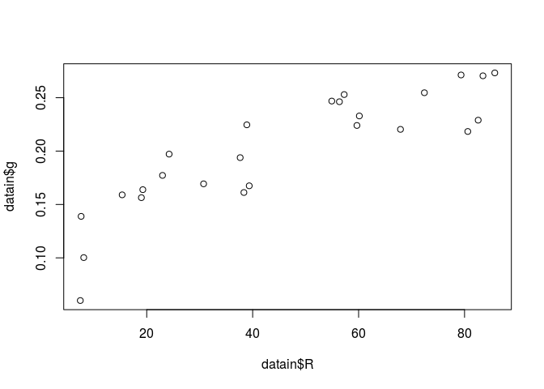
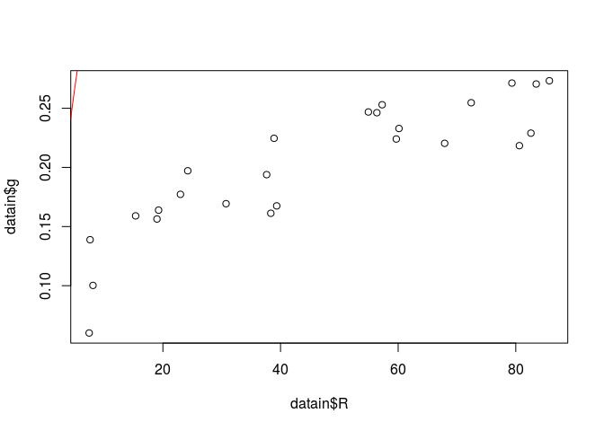
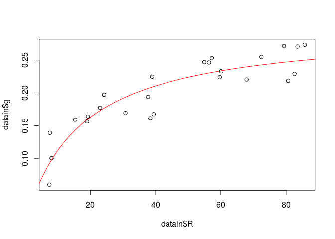
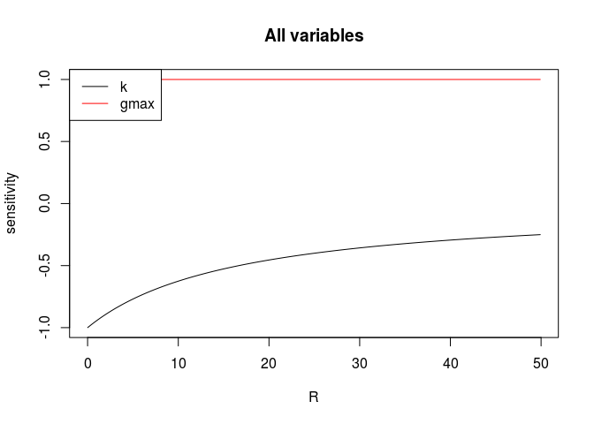
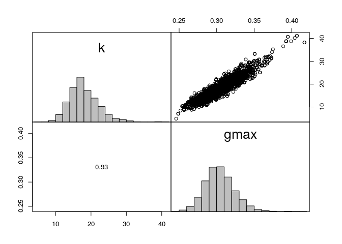
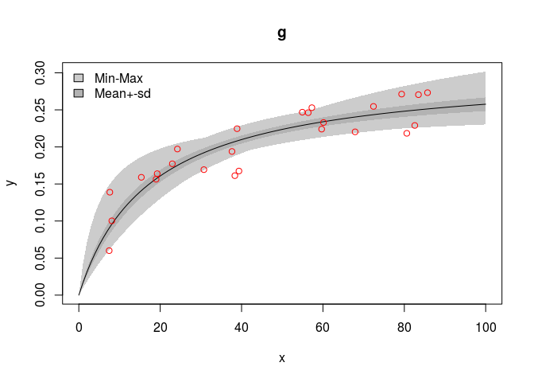

Model Calibration with the FME package
================
Arthur Capet
June 14, 2017

Foreword
========

This is an R Markdown document. Markdown is a simple formatting syntax for authoring PDF documents.

When you click the **Knit** button in Rstudio a pdf will be generated that includes both content as well as the output of any embedded R code chunks within the document. You can then modify the code inside the r chunk and update the pdf accordingly.

Objectives
----------

This is an example of script as should be produced during practical session of the lecture "Modélisation des écosystèmes et des cycles biogéochimiques" (Partim : Resource competition). It consist in calibrating the parameter of a simple growth function, in order to render observation of growth rates measured at different resource availability. (Those data have been created artificially and are located in a [text file](G1R1.txt) ). To do so we will exploit functions from "FME" library (Soetaert and Petzoldt 2010). The notions we are going to consider are pretty well explained in [this documentation](ftp://videolan.cs.pu.edu.tw/network/CRAN/web/packages/FME/vignettes/FME.pdf "Original FME paper"). To start, we simply load the `FME` library (which will automatically load the dependence libraries).

``` r
library(FME)
```

    ## Loading required package: deSolve

    ## Loading required package: rootSolve

    ## Loading required package: coda

Load Data
=========

Now we load the data using the `read.table` function which store them in a "data frame" structure (`datain`). We then assign names to the columns of `datain`. Remember the command `c("R","g")` create a vector of two string elements : "R" and "g". Here *R* goes for *ressource availability* and *g* for corresponding *growth rates*. To assign column names, you can use the function `colnames`

``` r
datain<-read.table(file="G1R1.txt")
colnames(datain)<-c("R","g")
```

Let us have a first view on those data and plot them (use `plot(x=, y=)`)

``` r
plot( x=datain$R ,y=datain$g)
```



Build a growth model
====================

The next block defines the function `Growth` using a simple Michalis-Menten function form

$g=g\_{max}\\frac{R}{R+k}$

`Growth` takes two arguments :

-   `pars` is a vector of two parameter : `gM` (*g*<sub>*m**a**x*</sub>) is the maximum growth rate, and `k` is the constant which determines how strongly the resource availability restricts growth (when *R* = *k*, *g* = *g*<sub>*m**a**x*</sub>/2).
-   `R` is the resource availability

The function returns a data frame with the ressource values `R`, and the corresponding growth rates `g`.

``` r
Growth <-function (pars,R) {
  with(as.list(pars),{
    g <- gmax*(R / (R + k ))
    return (data.frame(R=R,g=g))
  })
}
```

Now we define a vector of parameter `parms` with guess values (try k=10 and gmax= .8) and will use it to plot a curve depicting how the growth rate vary with the resource availability. Note that the growth rates are obtained using the function `Growth` previously defined, and depend on the set of parameter we are passing when calling this function.

The function `Growth` returns a data frame with both input *R* and resulting *g*. This is why in the following we have to use the nomenclature `growthoutput$g` the extract the column `g` from the data frame `growthoutput`.

*To Do*

-   Define the parameter vector
-   Call the growth function, using this parameters, for a range of `R=seq(0,100,.5)`
-   plot the points (as previoulsy) and add the model prediction, using the command `lines` (use `col=red` as argument)

``` r
parms <- c(k = 10, gmax=.8)

# Plot data points from the text file
plot( x=datain$R ,y=datain$g)

growthoutput=Growth(parms,seq(0,100,.5))

# Plot computed growth rates for a range R going from 0 to 100 by step of .5
lines(x=growthoutput$R,y=growthoutput$g, col="red")
```



Calibration
===========

To adjust the parameters we first to quantify the model misfit, ie. we need a function that receives a set of parameter and returns the residuals (ie, the difference between the *g* measured and those predicted by the growth model at the *R* value considred in the measurements).

``` r
ModelCosta <- function(p) {
  out <- Growth(p, datain$R)
  return(  datain$g-out$g )  # residuals
}
ModelCosta(parms)
```

    ##  [1] -0.27036922 -0.17740577 -0.04354337 -0.09694207 -0.21919840
    ##  [6] -0.21672902 -0.20208996 -0.26120461 -0.11882851 -0.21974509
    ## [11] -0.17167727 -0.25928609 -0.22024623 -0.15232522 -0.09863905
    ## [16] -0.22799059 -0.09900747 -0.10733768 -0.30968723 -0.24972277
    ## [21] -0.25165009 -0.15599944 -0.07097069 -0.14136541 -0.14670261

We can now use the function `modFit`, to find the set of parameters that minimize the residuals given by `ModelCosta`. Here, we selected the "Pseudo" search algorithm and imposed bounds for the parameters \[0 1000\] and \[0 1000\] (type ´?modFit´ for more Details).

``` r
Fita <- modFit(f = ModelCosta,
               p = parms,
               method="Pseudo",
               lower=c(0,0),
               upper=c(1000,1000))
```

`Fita` is now an object of the class modFit, which contains a number of attributes, and which can be used as an argument to dedicated functions as illustrated below

-   `summary` gives some stats on the calibration procedure
-   `coef` returns the value of the best parameters

``` r
# What is the value of the fitted parameters, and the standard error on those parameters ? 
summary(Fita)
```

    ## 
    ## Parameters:
    ##      Estimate Std. Error t value Pr(>|t|)    
    ## k     4.64662    1.47467   3.151  0.00447 ** 
    ## gmax  0.50854    0.02011  25.291  < 2e-16 ***
    ## ---
    ## Signif. codes:  0 '***' 0.001 '**' 0.01 '*' 0.05 '.' 0.1 ' ' 1
    ## 
    ## Residual standard error: 0.04602 on 23 degrees of freedom
    ## 
    ## Parameter correlation:
    ##           k   gmax
    ## k    1.0000 0.8561
    ## gmax 0.8561 1.0000

``` r
coef(Fita)
```

    ##         k      gmax 
    ## 4.6466236 0.5085352

We can now check visually that the fitted parameters provides a better description of the data, by evaluating `Growth` on the same range of *R* but using the new parameters.

*To Do*

-   Start by plotting the data, as previously.
-   Now use lines command to show model outputs, but provides the best parameters from the modFit procedure to evaluate the model

``` r
# Plot 
plot(x=datain$R,y=datain$g)
lines(x=seq(0,100,.5),y=Growth(coef(Fita),seq(0,100,.5))$g, col="red")
```



Sensitivity
===========

*Which parameter has the more impact on the model output ?*

The function `sensFun` evaluates sensitivity function around the prescribed parameter values (type `?sensFun` for definitions).

$$S\_{i,j}=  \\frac{\\partial y\_i}{\\partial \\Theta\_j}$$
 where,

-   *y*<sub>*i*</sub> is the output variable (*g* in our case)
-   *Θ*<sub>*j*</sub> is a parameter

These value can be summarized using the scales :
*L*<sub>1</sub>(*Θ*<sub>*j*</sub>)=∑|*S*<sub>*i*, *j*</sub>|/*n*
 and
$$ L\_2(\\Theta\_j) = \\sqrt{\\sum S\_{i,j}^2/n} $$
 Try `?sensFun` to identify the arguments required by `sensFun` (*hint* : in our case we will need 2+1 arguments).

*To do*

-   Store the ouput of `sensFun` in `SF`
-   use summary , and plot to visulaize the sensitivity.

``` r
sF <- sensFun(f = Growth,  parms= coef(Fita),R=seq(.01,50,.1))
summary(sF)
```

    ##      value scale   L1    L2  Mean Min    Max   N
    ## k     4.65  4.65 0.23 0.013 -0.23  -1 -0.085 500
    ## gmax  0.51  0.51 1.00 0.045  1.00   1  1.000 500

``` r
plot(sF)
```



A few question to reflect on :

-   Why it the sensitivity to *g*<sub>*m**a**x*</sub> always equal to 1 ?
-   Why is the sensitivity to *k* always negative ?
-   Why is the sensitivity to *k* decreasing at large *R* values ?

Note (by testing it) that *L*<sub>1</sub> and *L*<sub>2</sub> norms depend on the *R* value considered and on the initial parameter values.

Distribution of parameters
==========================

Instead of identifying a single set of "best" parameters, other approaches provides a probality distribution for parameter values.

It is better in the sense that is is statistically exploitable to derive error on model estimates. One such method is to use Monte Carlo Markov Chain. Here the transfer function returns an object `ModCost`, which is more complete than the simple residals we used previously.

``` r
ModelCostb <- function(P) {
  out <- Growth(P, datain$R)
  return(
    modCost(obs=datain,mod=out,x="R")
  )  
}

Fitb <- modFit(f = ModelCostb,
               p = parms,
               method="Pseudo",
               lower=c(0,0),
               upper=c(10000,10000))

sss<-summary(Fitb)

MCa <- modMCMC(f = ModelCostb,
               p = coef(Fitb),lower=c(0,0),
               upper=c(100,100),
               var0 = Fitb$var_ms,
               jump=sss$cov.scaled * 2.4^2/5,
               updatecov = 50,
               wvar0 = 0.1,niter=5000)#,
```

    ## number of accepted runs: 1837 out of 5000 (36.74%)

``` r
# This plots provides the selected parameter distributions
pairs(MCa)
```



Given a distribution of parameters, such as provided from the previous procedure, the function `sensRange` allows to assess the distribution of model outputs. In this case we can consider it illustrates the uncertainties of model estimates deriving from the uncertainity on the calibrated parameters.

``` r
sR <- sensRange(func=Growth, parms = coef(Fitb),
                parInput = MCa$par,
                R=seq(0,100,1),
                num = length(MCa$par))
plot(summary(sR))
points(datain,col='red')
```



References
==========

Soetaert, Karline, and Thomas Petzoldt. 2010. “Inverse modelling, sensitivity and monte carlo analysis in R using package FME.” *Journal of Statistical Software* 33 (3): 1–28.
