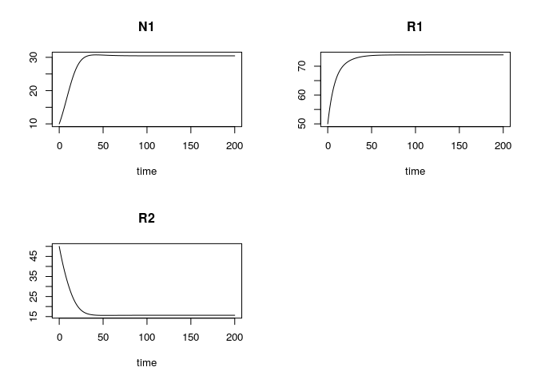
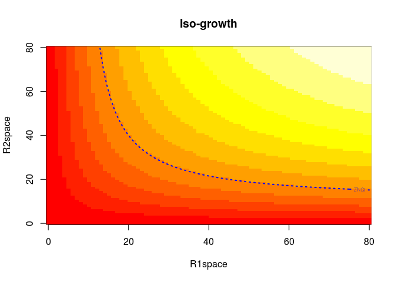
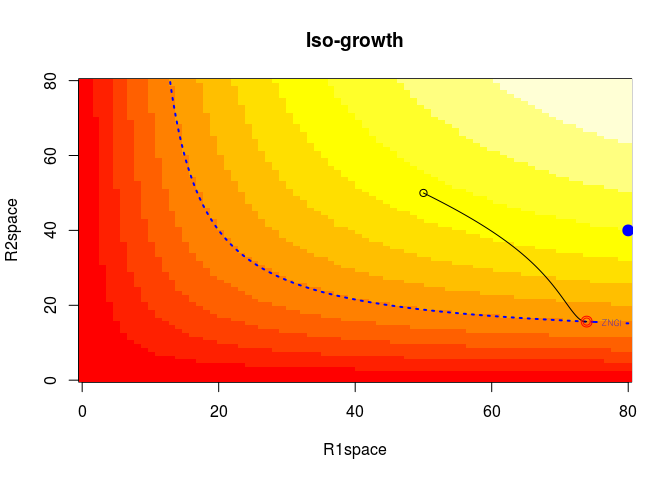
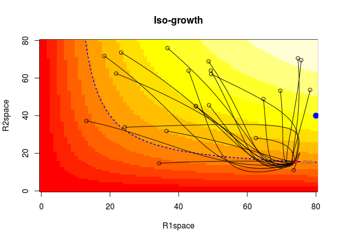

Tilman's Resource Competition : 1 species 2 resources
================
Arthur Capet
June 15, 2017

This script allows to visualize the dynamics of a single species depending on two ressources (Tilman 1982). You might want to have a look on the [course notes](https://www.overleaf.com/read/krhfddzjxnqc) before going any further.

``` r
library("deSolve") # For solving differential equations
library("FME")     # Toolbox to play with model perturbation, sensitivity analysis, etc..
```

Our system is defined at a given time by the 3 state variables

-   *N*<sub>1</sub> (the population),
-   *R*<sub>1</sub> and *R*<sub>2</sub> (the ressources).

The growth of *N*<sub>1</sub> will depend on the availability of both resources in a specific way, defined in the function `growth1`.

All parameters that will be used later are given in a vector (those used in the growth function, but also those used for initial conditions, resource supply, etc .. )

``` r
pars<-c(
  # Population
  mN1  = .1    ,  # mortality N1
  # Params for growth
  mu1 = .5     ,  # Max Growth 
  limN1R1 = 30 ,  # Half-Saturation R1
  limN1R2 = 40 ,  # Half-Saturation R2
  # Resources supply
  g1  = 80     ,  # Supply R1 (max R1)
  g2  = 40     ,  # Supply R2 (max R2)
  gT  = 10     ,  # Relaxation time towards max Conc
  # Initial conditions
  N1_0 = 10    ,  # Initial population N1
  R1_0 = 50    ,  # Initial stock R1
  R2_0 = 50    ,  # Initial stock R2
  # Simulation
  dt=.1
)
```

The main growth function `growth1` can take different form, representing different kind of resource (cf. lectures). Currently, we just switch to one or another form by commenting/uncommenting part of the code.

`growth1` uses three arguments :

-   `R1` and `R2` are the two resources availabilities
-   `hneed` is a flag. If *False*, the function returns only the growth rate. If *True*, the function also returns `h1` and `h2`, the components of the resource consumption vector.

``` r
growth1<- function (R1,R2,hneed=F) {
  with (as.list(pars), {
    f1R1 <- R1 / (R1 + limN1R1)
    f1R2 <- R2 / (R2 + limN1R2)
    
     #############
     # Essential #
     #############
    
     # f1 <- mu1 * pmin(f1R1,f1R2)
     # a<-.5
     # h1 <- a
     # h2 <- (1-a)
     # 
     # casestring<<-("Essential")

     #########################
     # Interactive Essential #
     #########################
    
     f1 <- mu1 * f1R1*f1R2
     a<-.2
     h1 <- (a)
     h2 <- (1-a)

     casestring<<-("InteractiveEssential")

     ##########################
     # Perfectly Substitutive
     ##########################
     
     # f1 <- mu1 * (R1+R2)/ ( R1+R2  + limN1R1+ limN1R2 )
     # h1 <- R1/(R1+R2)
     # h2 <- R2/(R1+R2)
     # casestring<<-("PerfectlySubstitutive")
     
     ##################
     # Complementary #
     #################
     
     # f1 <- mu1 * ((R1+R2+R1*R2/10)/ (R1+R2+R1*R2/10+limN1R1+limN1R2))
     # h1 <- R1/(R1+R2)
     # h2 <- R2/(R1+R2)

     ##########################
     # Antagonistic
     ##########################
     # f1 <- mu1 * ((R1+R2-R1*R2/80)/ (R1+R2-R1*R2/80+limN1R1+limN1R2))
     # h1 <- R1/(R1+R2)
     # h2 <- R2/(R1+R2)
     # casestring<<-("Antagonistic")

     ##########################
     # Switching
     ##########################

     # f1 <- mu1 * pmax(R1,R2)/ (pmax(R1,R2)+   limN1R1+limN1R2 )
     # 
     # h1 <- R1/(R1+R2)
     # h2 <- R2/(R1+R2)
     #  if (R1>R2){
     #  h1 <- 1
     #  } else {
     #    h1 <- 0
     #  }
     #  h2<-1-h1
     
    if (hneed){
      return(c(f1=f1,h1=h1,h2=h2))
    } else {
      return(f1)
    }

  })
}
```

The following function `simpleg` provides the time derivatives for the state variables `X`, in order to compute how the system evolves in time. Those time derivatives depend on the current state, and are affected by the parameters and form of the growth function.

``` r
simpleg <- function (t, X, parms) {
  with (as.list(parms), {
    N1 <- X[1]
    R1 <- X[2]
    R2 <- X[3]
    
    # Get the growth rate.
    # Because the third argument is "True", G is a vector with three named components.
    # (see definition of growth1)
    G<-growth1(R1,R2,T)
    f1<-G["f1"]
    h1<-G["h1"]
    h2<-G["h2"]
    
    dN1 <- N1 * (f1 - mN1) # growth minus mortality
    dR1 <-  (g1-R1)/gT - N1 * (f1 )* h1 # supply minus consumption 
    dR2 <-  (g2-R2)/gT - N1 * (f1 )* h2 # supply minus consumption
    
    # Return the time derivative, the list structure is required by the solving package
    return(list(c(dN1, dR1 , dR2)))
  })
}
```

Dynamic simulation
==================

In the following, we

-   define the initial conditions `X0`,
-   define a number of time step, set a temporal framework
-   run first a dynamic simulation, solving the problem in time, ie. looking at the evolution of the population and resources.

``` r
X0 <- with(as.list(pars),c(N1_0,R1_0,R2_0))

# time intervals at which we want the outputs
times <- seq(0, 200, by = pars["dt"])        

# function ode is the solver, it computes the dynamic simulation.
out <- ode(y = X0, times = times, func = simpleg, parms = pars,method = "euler")

# this give names to the simulation output 
colnames(out)<-c("time","N1","R1","R2")      
plot(out)
```



Steady-state solution
=====================

Next, we compute directly the steady-state solution, ie the value of state variables for which the time derivative are nul: *growth* compensate for *mortality*, and resource *supply* compensate for *consumption*. The system is balanced, at equilibrium.

The values correspond to the last values of the dynamic run, but they were computed faster, from theoritical considerations, rather than waiting for the system to reach equilibrium by itself.

``` r
# this provides the steady state solution
outsteady<-steady(y = X0, time=c(0,Inf),func = simpleg, parms = pars, method= "runsteady")
outs <- outsteady$y
names(outs)<-c("N1","R1","R2")
print(outs)
```

    ##       N1       R1       R2 
    ## 30.44175 73.91165 15.64660

Growth on the resource plane
----------------------------

Here, we want to explore how the equilibrium point (such as obtained above) depends on the growth function parameters and initial conditions. The locus of different equilibirum points, in the resource place (with axis *R*<sub>1</sub> and *R*<sub>2</sub>), is called the *zero net growth isoline*, or *ZNGI*.

First, we compute growth rates for all values of *R*<sub>1</sub> and *R*<sub>2</sub> and display it with colour. Second we highlight the location where growth rate equals mortality rate.

``` r
# Defining the extent of the ressource space to explore
R1space <- seq(0,80, length=80)
R2space <- seq(0,80, length=80)

# this function evaluate growth 1 for every value of (R1space,R2space)
f1space <- outer(R1space,R2space,growth1)
# First we plot the contour
image(R1space ,R2space ,f1space,main="Iso-growth")

# then we add the line were growth is equal to mortality (= the value in pars["mN1"])
contour(R1space ,R2space ,f1space,levels=as.vector(pars["mN1"]),add=T,col="blue",lty = "dotted", labels="ZNGI",lwd=2)
```



Here we will visualize the trajectory of the simulation we computed just above.

``` r
image(R1space ,R2space ,f1space,main="Iso-growth")
contour(R1space ,R2space ,f1space,levels=as.vector(pars["mN1"]),
        add=T,col="blue",lty = "dotted", labels="ZNGI",lwd=2)

# Now, we plot R1 and R2 from the dynamic solution
lines(out[,"R1"],out[,"R2"])
# highlight the first values of R1 and R2
points(out[1,"R1"],out[1,"R2"])
# the last values
points(out[nrow(out),"R1"],out[nrow(out),"R2"],col='red')
points(outs["R1"],outs["R2"],col='red',cex=1.5)

# Locate the Supply Point
points(pars["g1"],pars["g2"],col='blue',cex=1.5,bg='blue',pch=21)
```



Finally, to illustrate that this point is a stable equlibrium point we will use the `modCRL` function from the FME package (Soetaert and Petzoldt 2010), to perturbate initial conditions and display corresponding trajectories. The modCRL function (type `?ModCRL`) needs a transfer function (`fCRL` below) that will do something with different values of the parameters. `modCRL` perturbates a subset of the parameters (as defined in `parRange`), call to the transfer function with perturbated parameters and stores the result. In this case, though, it is the transfer function `fCRL` that directly display the trajectory on the plot.

``` r
# Just reproduce the same plot as above
image(R1space ,R2space ,f1space,main="Iso-growth")
contour(R1space ,R2space ,f1space,levels=as.vector(pars["mN1"]),
        add=T,col="blue",lty = "dotted", labels="ZNGI",lwd=2)
points(pars["g1"],pars["g2"],col='blue',cex=1.5,bg='blue',pch=21)

# define the function to be used by modCRL  
fCRL<-function(parinit){
    X0 <- with(as.list(parinit),c(N1_0,R1_0,R2_0))
    out<- ode(y = X0, times = times, func = simpleg, parms = pars,method="euler")
    colnames(out)<-c("time","N1","R1","R2")
    
    lines(out[,"R1"],out[,"R2"]  )
    points(out[1,"R1"],out[1,"R2"])
    points(out[nrow(out),"R1"],out[nrow(out),"R2"],col='red')
    return(c("R1eq"=out[nrow(out),"R1"], "R2eq"=out[nrow(out),"R2"]))
  }
  
# define the perturbation of initial conditions in the matrix parRange
# nr and nc are number of rows and columns,
# next vector the values (of min and max)
# dimnames give names to columns and rows of the matric
parRange <- matrix(nr = 3, nc = 2, 
                   c(0.2, 10,10,50,80,80),
                     dimnames = list(c("N1_0","R1_0","R2_0"), c("min", "max")))

# calling fCRL for 20 set of parameters whitin the range parRange
CRL<-modCRL(fCRL,parRange=parRange,num = 20)
```



Next we will see what happens when two species competes for the same resources : [the 2 species case](3_Tilman_2species.pdf)

References
==========

Soetaert, Karline, and Thomas Petzoldt. 2010. “Inverse modelling, sensitivity and monte carlo analysis in R using package FME.” *Journal of Statistical Software* 33 (3): 1–28.

Tilman, David. 1982. *Resource Competition and Community Structure*. Princeton university press.
