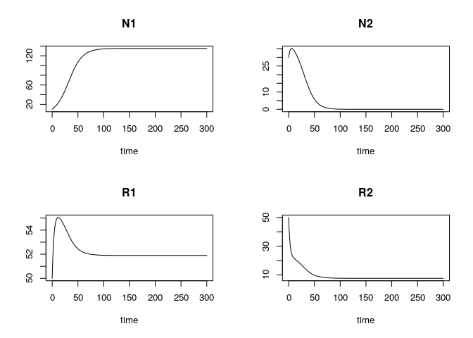

Tilman’s Resource Competition : 2 species 2 resources
================
Arthur Capet
June 15, 2017

  - [Function and parameter
    definitions](#function-and-parameter-definitions)
  - [A first simulation](#a-first-simulation)
      - [PLOT 1 : Trajectories, Resource space and
        ZNGI](#plot-1-trajectories-resource-space-and-zngi)
      - [PLOT2 : perturbation on the supply
        point](#plot2-perturbation-on-the-supply-point)
      - [Exercice 2 (Optionnal)](#exercice-2-optionnal)
  - [References](#references)

This script allows to visualize the dynamics of two species depending
competing for two ressources(Tilman 1982). You might want to have a look
on the [course notes](https://www.overleaf.com/read/krhfddzjxnqc) before
going any further.

In this third sesssion, we are going to add a second species to the
system. So we will have two resources and two species, and be able to
test assumptions about cohabitation.

``` r
library("deSolve") # For solving differential equations
library("FME")     # Toolbox to play with model perturbation, sensitivity analysis, etc..
```

# Function and parameter definitions

1.  Parameters for growth should now given for both species \(N_1\) and
    \(N_2\).

2.  Remember that, in order to be callable for both species, the
    function `Growth` receives species-specifc parameter as an input
    argument.

<!-- end list -->

``` r
pars<-c(
  # Species N1
  mN1  = .1     ,  # mortality N1
  mu1 = .5      ,  # Max Growth 
  limN1R1 = 60  ,  # Half-Saturation R1 for N1
  limN1R2 = 10  ,  # Half-Saturation R2 for N1
  a11     = .6  ,  # Resource preference for R1, N1 [0-1]
  
  # Species N2
  mN2  = .15    ,  # mortality N2  (solutions)
  mu2 = .5      ,  # Max Growth    (solutions)
  limN2R1 = 10  ,  # Half-Saturation R1 for N2 (solutions)
  limN2R2 = 45  ,  # Half-Saturation R2 for N2 (solutions)
  a21     = .4  ,  # Resource preference for R1, N2 [0-1] (solutions)
  
  # Resources
  g1  = 60      ,  # Supply R1 (max R1 if no consumption)
  g2  = 40      ,  # Supply R2 (max R2 if no consumption)
  gT  = 3       ,  # Relaxation time towards max Conc
  gnoise = 0     ,  # Signal to noise ratio # (solutions to Ex. 2)
  
  # Initial conditions
  N1_0 = 10     ,  # Initial population N1
  N2_0 = 30     ,  # Initial population N2 (solutions)
  R1_0 = 50     ,  # Initial stock R1
  R2_0 = 50     ,  # Initial stock R2

    # Simulation
  duration = 300,
  dt=.1
)
  # Ressource type
  #ftype="Essential"
  ftype="InteractiveEssential"
```

In order to be callable for both species, the function `Growth` has been
built to receive species-specifc parameters as an input argument. We
don’t have to modify it.

``` r
Growth<- function (R1,R2,Pp,hneed=F) {
  # Pp gives the species parameters 
  # * limR1
  # * limR2
  # * mu 
  # The 'with' function executes the code in {} with elements of the list (first argument)
  #    included as part of the local environment
  with (as.list(Pp), {
    fR1 <- R1 / (R1 + limR1)
    fR2 <- R2 / (R2 + limR2)
    
    if (ftype %in% c("Essential",
                      "InteractiveEssential",
                      "PerfectlySubstitutive",
                      "Complementary",
                      "Antagonistic") ){
    }else{
      print(' F type unknown, imposing Essential type' )
             ftype <- "Essential"                 
                      }
    #############
    # Essential #
    #############
    if (ftype=="Essential"){
    f <- mu * pmin(fR1,fR2)
    h1 <- a
    h2 <- (1-a)
    }
    #########################
    # Interactive Essential #
    #########################
        if (ftype=="InteractiveEssential"){
    f <- mu * fR1*fR2
    a<-.2
    h1 <- (a)
    h2 <- (1-a)
    }
    ##########################
    # Perfectly Substitutive #
    ##########################
        if (ftype=="PerfectlySubstitutive"){
    f <- mu * (R1+R2)/ ( R1+R2  + limR1+ limR2 )
    h1 <- R1/(R1+R2)
    h2 <- R2/(R1+R2)
        }
     
    #################
    # Complementary #
    #################
    if (ftype=="Complementary"){
     f <- mu * ((R1+R2+R1*R2/10)/ (R1+R2+R1*R2/10+limR1+limR2))
     h1 <- R1/(R1+R2)
     h2 <- R2/(R1+R2)
    }
    ################
    # Antagonistic #
    ################
    if (ftype=="Antagonistic"){
     f <- mu * ((R1+R2-R1*R2/80)/ (R1+R2-R1*R2/80+limR1+limR2))
     h1 <- R1/(R1+R2)
     h2 <- R2/(R1+R2)
     }
    #############
    # Switching #
    #############
    # f <- mu * pmax(R1,R2)/ (pmax(R1,R2)+   limR1+limR2 )
    # 
    # h1 <- R1/(R1+R2)
    # h2 <- R2/(R1+R2)
    #  if (R1>R2){
    #  h1 <- 1
    #  } else {
    #    h1 <- 0
    #  }
    #  h2<-1-h1
    
    if (hneed){
      return(c(f=f,h1=h1,h2=h2))
    } else {
      return(f)
    }
  })
}
```

The function providing the temporal derivatives has to be adapted.

1.  There is an additional state variables.
2.  Growth shoud be called two times, once, for each species.

<!-- end list -->

``` r
simpleg <- function (t, X, parms) {
  with (as.list(parms), {
    N1 <- X[1]
    N2 <- X[2]    # (solutions)
    R1 <- X[3]
    R2 <- X[4]
    
    # Return the growth rate and consumption vectors for N1
    pN1<-c( limR1 = limN1R1 ,
            limR2 = limN1R2 ,
            mu    = mu1     , 
            a     = a11     )
    
    G1<-Growth(R1,R2,pN1,T)
    
    f1<-G1["f"]
    h11<-G1["h1"]
    h12<-G1["h2"]
    
    # Return the growth rate and consumption vectors for N2
    pN2<-c( limR1 = limN2R1 ,    # (solutions)
            limR2 = limN2R2 ,    # (solutions)
            mu    = mu2     ,    # (solutions)
            a     = a21     )    # (solutions)
    
    G<-Growth(R1,R2,pN2,T)       # (solutions)
    f2<-G["f"]                   # (solutions)
    h21<-G["h1"]                 # (solutions)
    h22<-G["h2"]                 # (solutions)
    
    # Time derivatives
    dN1 <- N1 * (f1 - mN1)
    dN2 <- N2 * (f2 - mN2)       # (solutions)
    
    ## The following lines allows to include a stochastic term in the supply
    supply1 = (g1+ runif(1,-gnoise,gnoise)  -R1)/gT # (solutions to Ex. 2)
    supply2 = (g2+ runif(1,-gnoise,gnoise)  -R2)/gT # (solutions to Ex. 2)

    dR1 <-   supply1 - N1*f1*h11 - N2*f2*h21 # (solutions, add the 3rd term)
    dR2 <-   supply2 - N1*f1*h12 - N2*f2*h22 # (solutions, add the 3rd term)
    
    # Return the time derivative
    return(list(c(dN1, dN2, dR1 , dR2)))     # (solutions, add dN2)
  })
}
```

# A first simulation

As before, start with a dynamic run and display the evolution of state
variables.

  - How should the vector of initial conditions be exteneded ?

<!-- end list -->

``` r
X0 <- with(as.list(pars),c(N1_0,N2_0,R1_0,R2_0))   # (solutions, add N2_0)
times <- seq(0, pars["duration"], by = pars["dt"]) # output wanted at these time intervals

out <- ode(y = X0, times = times, func = simpleg, parms = pars,method = "euler")
colnames(out)<-c("time","N1","N2","R1","R2") # (solutions, add N2)
plot(out)
```

<!-- -->

## PLOT 1 : Trajectories, Resource space and ZNGI

We’ll use the steady simulation to illustrate competition, trajectories
and equilibrium on the resource plane. First let us compute the growth
values over the resource plane for both \(N_1\) and \(N_2\). We will
only display ZNGI for both species (ie. no colored background).

``` r
R1space <- seq(0,80, length=80)
R2space <- seq(0,80, length=80)

with (as.list(pars), {
  pN1 <<-c( limR1 = limN1R1 ,
          limR2 = limN1R2 ,
          mu    = mu1,
          a =a11  )
  pN2 <<-c( limR1 = limN2R1 ,     # (solutions, add N2)
          limR2 = limN2R2 ,       # (solutions, add N2)
          mu    = mu2,            # (solutions, add N2)
          a =a11 )                # (solutions, add N2) 
})
  
f1space <- outer(R1space,R2space,Growth,Pp=pN1)
f2space <- outer(R1space,R2space,Growth,Pp=pN2) # (solutions, add N2)

# ZNGI for N1
contour(R1space ,R2space ,f1space,levels=as.vector(pars["mN1"]),col="red",lty = "dotted", labels="ZNGI 1",
        lwd = 3,
        vfont = c("sans serif", "plain"),
        labcex=1.5,
        xlab = "R1",
        ylab="R2")

# ZNGI for N2  
contour(R1space ,R2space ,f2space,                             # (solutions)
        levels=as.vector(pars["mN2"]),                         # (solutions)
        col="red",lty = "dotted",                              # (solutions)
        labels="ZNGI 2",lwd = 3,                               # (solutions)
        vfont = c("sans serif", "plain"), labcex=1.5,add=T)    # (solutions)

# trajectories of the dynamic simulation
lines(out[,"R1"],out[,"R2"]  )
points(out[1,"R1"],out[1,"R2"],pch = 19)

# Equilibrium points and resource supply point
points(out[nrow(out),"R1"],out[nrow(out),"R2"],col='red',pch = 19)
points(pars["g1"],pars["g2"],col='blue',cex=1.5,bg='blue',pch=21)
```

<!-- -->

## PLOT2 : perturbation on the supply point

We now the perturbate supply point value, as in TP2.

``` r
  fCRL<-function(parinit){
    parsl<-pars
    parsl[names(parinit)]<-parinit
    
    X0 <- with(as.list(parsl),c(N1_0,N2_0,R1_0,R2_0))  # (solutions, add N2_0)
    
    out<- ode(y = X0, times = times, func = simpleg, parms = parsl,method="euler")
    colnames(out)<-c("time","N1","N2","R1","R2")   # (solutions, add N2)

    points(parsl["g1"],parsl["g2"],col='blue',cex=1.5,bg='blue',pch=21)
    
    lines(c(parsl["g1"],out[length(times),"R1"]),c(parsl["g2"],out[length(times),"R2"]) , lty=2 )
    points(out[1,"R1"],out[1,"R2"],pch = 19)
    points(out[nrow(out),"R1"],out[nrow(out),"R2"],col='red',pch = 19)
    return(c("R1eq"=out[nrow(out),"R1"], "R2eq"=out[nrow(out),"R2"]))
  }
  
  parRange <- matrix(nr = 2, nc = 2, c(0, 0, 80,80 ,
                                       50,   50, 80,80 ),
                     dimnames = list(c("g1","g2"), c("min", "max")))
  parRange
```

    ##    min max
    ## g1   0  80
    ## g2   0  80

``` r
  contour(R1space ,R2space ,f1space,levels=as.vector(pars["mN1"]),col="red",lty = "dotted", labels="ZNGI 1",
          lwd = 3,
          vfont = c("sans serif", "plain"),
          labcex=1.5,
          xlab = "R1",
          ylab="R2")
  contour(R1space ,R2space ,f2space,levels=as.vector(pars["mN2"]),col="red",lty = "dotted", labels="ZNGI 2",lwd = 3,vfont = c("sans serif", "plain"), labcex=1.5,add=T)
  

  CRL<-modCRL(fCRL,parRange=parRange,num = 20)
```

<!-- -->
\#\# PLOT3: perturbation on the supply point - Cohabitation ?

Finally, we will plot the supply point with a certain color, according
to the results of competition at equilibrium: Which species survives? Is
cohabitation possible ?

Since trajectories in the ressources plane does not provide information
about species variables, we will use the color of the supply points to
indicate different cases for cohabitations.

In the plot above, we added the supply point with the command :
`points(parsl["g1"],parsl["g2"],col='blue',cex=1.5,bg='blue',pch=21)`

Here, instead of “blue”, we will use a variable COL, which has to be
given a value “blue” if both species survive, “red” if only N1 survives,
“green” if only N2 survives, and “black” if none survives.

As we’ve seen previously, it may take a long time for a species to
actually reach a population of exactly zero. Therefore, as a criterion
for “non-survival”, we suggest to use the fact that the population is
below a given thresold, for instance `TOL =0.01`, rather than being
exactly equal to zero.

``` r
fCRL<-function(parinit){
  parsl<-pars
  parsl[names(parinit)]<-parinit
  
  X0 <- with(as.list(parsl),c(N1_0,N2_0,R1_0,R2_0))
  
  out<- ode(y = X0, times = times, func = simpleg, parms = parsl,method="euler")
  colnames(out)<-c("time","N1","N2","R1","R2")
  
  # Give a color to the points according to surviving species
  N1final <- out[length(times),"N1"]
  N2final <- out[length(times),"N2"]
  
  TOL=0.01
  if (N1final> TOL & N2final> TOL) {
  COL="blue"  # Cohabitation
  }
  if (N1final > TOL & N2final <= TOL) {
    COL="red"  # only N1 survives
  }
  if (N1final <= TOL & N2final> TOL) {
    COL="green"  # only N2 survives
  } 
  if (N1final <= TOL & N2final <= TOL) {
    COL="Black"  # No survival
  } 

  points(parsl["g1"],parsl["g2"],col=COL,cex=1.5,bg=COL,pch=21)
  lines(c(parsl["g1"],out[length(times),"R1"]),c(parsl["g2"],out[length(times),"R2"]) , lty=2 )
  points(out[1,"R1"],out[1,"R2"],pch = 19)
  points(out[nrow(out),"R1"],out[nrow(out),"R2"],col=COL,pch = 19)
  return(c("R1eq"=out[nrow(out),"R1"], "R2eq"=out[nrow(out),"R2"]))
}

parRange <- matrix(nr = 2, nc = 2, c(0, 0, 80,80 ,
                                     50,   50, 80,80 ),
                   dimnames = list(c("g1","g2"), c("min", "max")))
parRange
```

    ##    min max
    ## g1   0  80
    ## g2   0  80

``` r
contour(R1space ,R2space ,f1space,levels=as.vector(pars["mN1"]),col="red",lty = "dotted", labels="ZNGI 1",
        lwd = 3,
        vfont = c("sans serif", "plain"),
        labcex=1.5,
        xlab = "R1",
        ylab="R2")
contour(R1space ,R2space ,f2space,levels=as.vector(pars["mN2"]),col="red",lty = "dotted", labels="ZNGI 2",lwd = 3,vfont = c("sans serif", "plain"), labcex=1.5,add=T)


CRL<-modCRL(fCRL,parRange=parRange,num = 50)
```

<!-- -->

## Exercice 2 (Optionnal)

Can we say that heterogeneity in the system can enlarge the region of
the ressource space that allows cohabitation ?

To test this, insert a random term in the ressource supply (use function
`runif`), with a new paramter `gnoise`.

1.  Can you see a change in the region of the ressource plane where
    supply points allow coabitation (try different valur of `gnoise`)?

Note that to consider a proper comparison, the function `modCRL` allows
to use a fixed set of ‘perturbed parameters’ rather than picking random
values at each time. You may also consider a regular sampling of the
ressource place for the supply point (see help of `?modCRL`).

``` r
parRange <- matrix(nr = 2, nc = 2, c(0, 0, 80,80 ,
                                       50,   50, 80,80 ),
                     dimnames = list(c("g1","g2"), c("min", "max")))


parInput <- apply(parRange,1,function(l){
  runif(50,min=l['min'], max=l['max'])             # for a random pick 
  })
  
contour(R1space ,R2space ,f1space,levels=as.vector(pars["mN1"]),col="red",lty = "dotted", labels="ZNGI 1",
          lwd = 3,
          vfont = c("sans serif", "plain"),
          labcex=1.5,
          xlab = "R1",
          ylab="R2")

contour(R1space ,R2space ,f2space,levels=as.vector(pars["mN2"]),col="red",lty = "dotted", labels="ZNGI 2",lwd = 3,vfont = c("sans serif", "plain"), labcex=1.5,add=T)
  
pars['gnoise']<-0
CRL<-modCRL(fCRL,parInput = parInput)
```

<!-- -->

``` r
contour(R1space ,R2space ,f1space,levels=as.vector(pars["mN1"]),col="red",lty = "dotted", labels="ZNGI 1",
          lwd = 3,
          vfont = c("sans serif", "plain"),
          labcex=1.5,
          xlab = "R1",
          ylab="R2")

contour(R1space ,R2space ,f2space,levels=as.vector(pars["mN2"]),col="red",lty = "dotted", labels="ZNGI 2",lwd = 3,vfont = c("sans serif", "plain"), labcex=1.5,add=T)
  
pars['gnoise']<-20
CRL<-modCRL(fCRL,parInput = parInput)
```

<!-- -->

# References

<div id="refs" class="references hanging-indent">

<div id="ref-TILMAN">

Tilman, David. 1982. *Resource Competition and Community Structure*.
Princeton university press.

</div>

</div>
