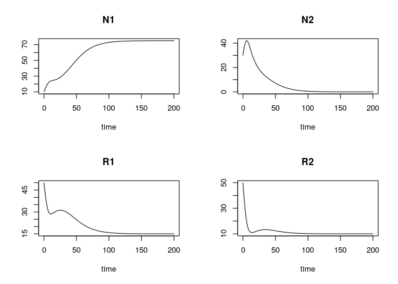
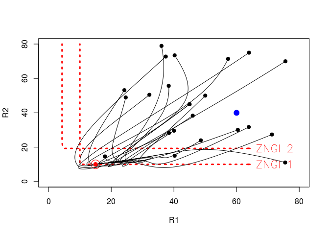
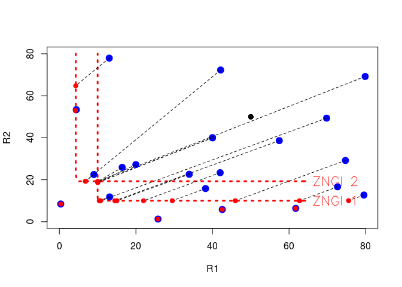
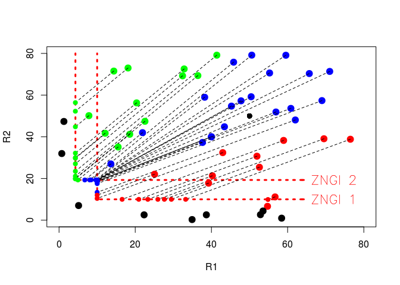

Tilman's Resource Competition : 2 species 2 resources
================
Arthur Capet
June 15, 2017

-   [Function and parameter definitions](#function-and-parameter-definitions)
-   [A first simulation](#a-first-simulation)
-   [Exploration of the resource space](#exploration-of-the-resource-space)
    -   [PLOT 1 : Trajectories](#plot-1-trajectories)
    -   [PLOT2 : perturbation on the supply point](#plot2-perturbation-on-the-supply-point)
-   [References](#references)

This script allows to visualize the dynamics of two species depending competing for two ressources(Tilman 1982). You might want to have a look on the [course notes](https://www.overleaf.com/read/krhfddzjxnqc) before going any further.

``` r
library("deSolve")
library("FME")
```

Function and parameter definitions
==================================

Parameters for growth are now given for both species *N*<sub>1</sub> and *N*<sub>2</sub>. In order to be callable for both species, the function `Growth` now receives species-specifc parameter as an input argument ( in [the 1 species case](2_Tilman_1species.pdf), those parameters where "global", here they are "local").

``` r
pars<-c(
  # Populations
  mN1  = .1     ,  # mortality N1
  mN2  = .15    ,  # mortality N2
  # param for growth
  mu1 = .5      ,  # Max Growth 
  limN1R1 = 40  ,  # Half-Saturation R1 for N1
  limN1R2 = 40  ,  # Half-Saturation R2 for N1
  mu2 = .5      ,  # Max Growth 
  limN2R1 = 10  ,  # Half-Saturation R1 for N2
  limN2R2 = 45  ,  # Half-Saturation R2 for N2
  a11     = .6  ,  # Resource preference for R1, N1 [0-1]
  a21     = .4  ,  # Resource preference for R1, N2 [0-1]
  # Resources
  g1  = 60      ,  # Supply R1 (max R1 if no consumption)
  g2  = 40      ,  # Supply R2 (max R2 if no consumption)
  gT  = 10      ,  # Relaxation time towards max Conc
  # Initial conditions
  N1_0 = 10     ,  # Initial population N1
  N2_0 = 30     ,  # Initial population N2
  R1_0 = 50     ,  # Initial stock R1
  R2_0 = 50     ,  # Initial stock R2
  # Simulation
  dt=.1
)

Growth<- function (R1,R2,Pp,hneed=F) {
  # Pp gives the species parameters 
  # * limR1
  # * limR2
  # * mu 
  # The 'with' function executes the code in {} with elements of the list (first argument)
  #    included as part of the local environment
  with (as.list(Pp), {
    fR1 <- R1 / (R1 + limR1)
    fR2 <- R2 / (R2 + limR2)
    
    #############
    # Essential #
    #############
    f <- mu * pmin(fR1,fR2)
    h1 <- a
    h2 <- (1-a)
    casestring<<-("Essential")

    #########################
    # Interactive Essential #
    #########################
     #f <- mu * fR1*fR2
     #a<-.2
     #h1 <- (a)
     #h2 <- (1-a)
     #casestring<<-("InteractiveEssential")
    
    ##########################
    # Perfectly Substitutive #
    ##########################
    # f <- mu * (R1+R2)/ ( R1+R2  + limR1+ limR2 )
    # h1 <- R1/(R1+R2)
    # h2 <- R2/(R1+R2)
    # casestring<<-("PerfectlySubstitutive")
     
    #################
    # Complementary #
    #################
    # f <- mu * ((R1+R2+R1*R2/10)/ (R1+R2+R1*R2/10+limR1+limR2))
    # h1 <- R1/(R1+R2)
    # h2 <- R2/(R1+R2)

    ################
    # Antagonistic #
    ################
    # f <- mu * ((R1+R2-R1*R2/80)/ (R1+R2-R1*R2/80+limR1+limR2))
    # h1 <- R1/(R1+R2)
    # h2 <- R2/(R1+R2)
    # casestring<<-("Antagonistic")

    #############
    # Switching #
    #############
    # f <- mu * pmax(R1,R2)/ (pmax(R1,R2)+   limR1+limR2 )
    # 
    # h1 <- R1/(R1+R2)
    # h2 <- R2/(R1+R2)
    #  if (R1>R2){
    #  h1 <- 1
    #  } else {
    #    h1 <- 0
    #  }
    #  h2<-1-h1
    
    if (hneed){
      return(c(f=f,h1=h1,h2=h2))
    } else {
      return(f)
    }
  })
}

simpleg <- function (t, X, parms) {
  with (as.list(parms), {
    N1 <- X[1]
    N2 <- X[2]
    R1 <- X[3]
    R2 <- X[4]
    
    # Return the growth rate and consumption vectors for N1
    pN1<-c( limR1 = limN1R1 ,
            limR2 = limN1R2 ,
            mu    = mu1     , 
            a     = a11     )
    
    G1<-Growth(R1,R2,pN1,T)
    
    f1<-G1["f"]
    h11<-G1["h1"]
    h12<-G1["h2"]
    
    # Return the growth rate and consumption vectors for N2
    pN2<-c( limR1 = limN2R1 ,
            limR2 = limN2R2 ,
            mu    = mu2     , 
            a     = a21     )
    
    G<-Growth(R1,R2,pN2,T)
    f2<-G["f"]
    h21<-G["h1"]
    h22<-G["h2"]
    
    # Time derivatives
    dN1 <- N1 * (f1 - mN1)
    dN2 <- N2 * (f2 - mN2)
    dR1 <-  (g1-R1)/gT - N1*f1*h11 - N2*f2*h21
    dR2 <-  (g2-R2)/gT - N1*f1*h12 - N2*f2*h22
    
    # Return the time derivative
    return(list(c(dN1, dN2, dR1 , dR2)))
  })
}
```

A first simulation
==================

As before we start with a dynamic run

``` r
X0 <- with(as.list(pars),c(N1_0,N2_0,R1_0,R2_0))
times <- seq(0, 200, by = pars["dt"]) # output wanted at these time intervals

out <- ode(y = X0, times = times, func = simpleg, parms = pars,method = "euler")
colnames(out)<-c("time","N1","N2","R1","R2")
plot(out)
```



Exploration of the resource space
=================================

We'll use the steady simulation to illustrate competition, trajectories and equilibrium on the resource plane. First let us compute the growth values over hte resource plane for *N*<sub>1</sub> and *N*<sub>2</sub>.

``` r
outsteady<-steady(y = X0, time=c(0,Inf),func = simpleg, parms = pars, method= "runsteady")
outs <- outsteady$y
names(outs)<-c("N1","N2","R1","R2")

R1space <- seq(0,80, length=80)
R2space <- seq(0,80, length=80)

with (as.list(pars), {
  pN1 <<-c( limR1 = limN1R1 ,
          limR2 = limN1R2 ,
          mu    = mu1,
          a =a11  )
  pN2 <<-c( limR1 = limN2R1 ,
          limR2 = limN2R2 ,
          mu    = mu2,
          a =a11 )
})
  
f1space <- outer(R1space,R2space,Growth,Pp=pN1)
f2space <- outer(R1space,R2space,Growth,Pp=pN2)
```

PLOT 1 : Trajectories
---------------------

``` r
# ZNGI for N1
contour(R1space ,R2space ,f1space,levels=as.vector(pars["mN1"]),col="red",lty = "dotted", labels="ZNGI 1",
        lwd = 3,
        vfont = c("sans serif", "plain"),
        labcex=1.5,
        xlab = "R1",
        ylab="R2")

# ZNGI for N2
contour(R1space ,R2space ,f2space,levels=as.vector(pars["mN2"]),col="red",lty = "dotted", labels="ZNGI 2",lwd = 3,vfont = c("sans serif", "plain"), labcex=1.5,add=T)

# trajectories of the dynamic simulation
lines(out[,"R1"],out[,"R2"]  )
points(out[1,"R1"],out[1,"R2"],pch = 19)

# Equilibrium points and resource supply point
points(out[nrow(out),"R1"],out[nrow(out),"R2"],col='red',pch = 19)
points(outs["R1"],outs["R2"],col='red',cex=2.5)
points(pars["g1"],pars["g2"],col='blue',cex=1.5,bg='blue',pch=21)

# as before, function that display a trajectory for a given set of initial condition
fCRL<-function(parinit){
  X0 <- with(as.list(parinit),c(N1_0,N2_0,R1_0,R2_0))
  out<- ode(y = X0, times = times, func = simpleg, parms = pars,method="euler")
  colnames(out)<-c("time","N1","N2","R1","R2")
    
  lines(out[,"R1"],out[,"R2"]  )
  points(out[1,"R1"],out[1,"R2"],pch = 19)
  points(out[nrow(out),"R1"],out[nrow(out),"R2"],col='red',pch = 19)
  return(c("R1eq"=out[nrow(out),"R1"], "R2eq"=out[nrow(out),"R2"]))
}

# how initial condition should be perturbated
parRange <- matrix(nr = 4, nc = 2, c(0.2, 0.2, 10,10 ,
                                       50,   50, 80,80 ),
                     dimnames = list(c("N1_0","N2_0","R1_0","R2_0"), c("min", "max")))
print(parRange)
```

    ##       min max
    ## N1_0  0.2  50
    ## N2_0  0.2  50
    ## R1_0 10.0  80
    ## R2_0 10.0  80

``` r
# the main call to perturbate parameter and display multiple trajectories
CRL<-modCRL(fCRL,parRange=parRange,num = 20)
```



PLOT2 : perturbation on the supply point
----------------------------------------

Instead of perturbating initial conditions, we now perturbate supply point value. You'll see that the position of the supply point determines the position of the equilibrium point somewhere over a *ZNGI*

``` r
  fCRL<-function(parinit){
    parsl<-pars
    parsl[names(parinit)]<-parinit
    
    X0 <- with(as.list(parsl),c(N1_0,N2_0,R1_0,R2_0))
    
    out<- ode(y = X0, times = times, func = simpleg, parms = parsl,method="euler")
    colnames(out)<-c("time","N1","N2","R1","R2")

    points(parsl["g1"],parsl["g2"],col='blue',cex=1.5,bg='blue',pch=21)
    
    lines(c(parsl["g1"],out[length(times),"R1"]),c(parsl["g2"],out[length(times),"R2"]) , lty=2 )
    points(out[1,"R1"],out[1,"R2"],pch = 19)
    points(out[nrow(out),"R1"],out[nrow(out),"R2"],col='red',pch = 19)
    return(c("R1eq"=out[nrow(out),"R1"], "R2eq"=out[nrow(out),"R2"]))
  }
  
  parRange <- matrix(nr = 2, nc = 2, c(0, 0, 80,80 ,
                                       50,   50, 80,80 ),
                     dimnames = list(c("g1","g2"), c("min", "max")))
  parRange
```

    ##    min max
    ## g1   0  80
    ## g2   0  80

``` r
  contour(R1space ,R2space ,f1space,levels=as.vector(pars["mN1"]),col="red",lty = "dotted", labels="ZNGI 1",
          lwd = 3,
          vfont = c("sans serif", "plain"),
          labcex=1.5,
          xlab = "R1",
          ylab="R2")
  contour(R1space ,R2space ,f2space,levels=as.vector(pars["mN2"]),col="red",lty = "dotted", labels="ZNGI 2",lwd = 3,vfont = c("sans serif", "plain"), labcex=1.5,add=T)
  

  CRL<-modCRL(fCRL,parRange=parRange,num = 20)
```

 \#\# PLOT3: perturbation on the supply point - Cohabitation ?

Finally, we will plot the supply point with a certain color, according to the results of competition at equilibrium: Which species survives? Is cohabitation possible ?

``` r
if (TRUE) {
  
  fCRL<-function(parinit){
    parsl<-pars
    parsl[names(parinit)]<-parinit
    
    X0 <- with(as.list(parsl),c(N1_0,N2_0,R1_0,R2_0))
    
    out<- ode(y = X0, times = times, func = simpleg, parms = parsl,method="euler")
    colnames(out)<-c("time","N1","N2","R1","R2")
    
    # Give a color to the points according to surviving species
    N1final <- out[length(times),"N1"]
    N2final <- out[length(times),"N2"]
    
    TOL=0.01
    if (N1final> TOL & N2final> TOL) {
    COL="blue"  # Cohabitation
    }
    if (N1final > TOL & N2final <= TOL) {
      COL="red"  # only N1 survives
    }
    if (N1final <= TOL & N2final> TOL) {
      COL="green"  # only N2 survives
    } 
    if (N1final <= TOL & N2final <= TOL) {
      COL="Black"  # No survival
    } 
 
    points(parsl["g1"],parsl["g2"],col=COL,cex=1.5,bg=COL,pch=21)
    lines(c(parsl["g1"],out[length(times),"R1"]),c(parsl["g2"],out[length(times),"R2"]) , lty=2 )
    points(out[1,"R1"],out[1,"R2"],pch = 19)
    points(out[nrow(out),"R1"],out[nrow(out),"R2"],col=COL,pch = 19)
    return(c("R1eq"=out[nrow(out),"R1"], "R2eq"=out[nrow(out),"R2"]))
  }
  
  parRange <- matrix(nr = 2, nc = 2, c(0, 0, 80,80 ,
                                       50,   50, 80,80 ),
                     dimnames = list(c("g1","g2"), c("min", "max")))
  parRange
  
  contour(R1space ,R2space ,f1space,levels=as.vector(pars["mN1"]),col="red",lty = "dotted", labels="ZNGI 1",
          lwd = 3,
          vfont = c("sans serif", "plain"),
          labcex=1.5,
          xlab = "R1",
          ylab="R2")
  contour(R1space ,R2space ,f2space,levels=as.vector(pars["mN2"]),col="red",lty = "dotted", labels="ZNGI 2",lwd = 3,vfont = c("sans serif", "plain"), labcex=1.5,add=T)
  
  
  CRL<-modCRL(fCRL,parRange=parRange,num = 50)
}
```



References
==========

Tilman, David. 1982. *Resource Competition and Community Structure*. Princeton university press.
